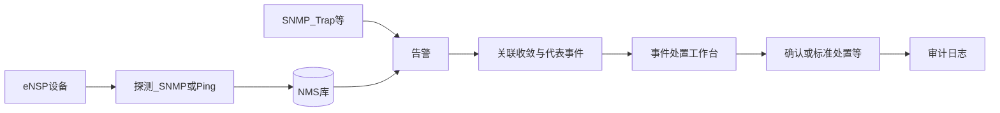
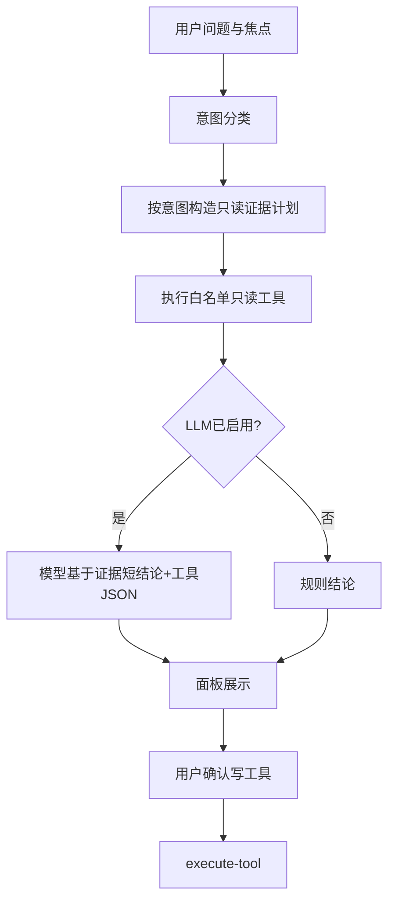

# eNSP NMS 软件说明

> 本文档描述**当前代码实现的产品形态**，作为产品讨论与后续重构（含内嵌 LLM）的共同基线。  
> 开发启动见仓库根目录 [README.md](../README.md)。  
> 开源许可：Apache License 2.0（见仓库根目录 `LICENSE` / `NOTICE`）。  
> 生成日期：2026-08-05 · 以仓库代码为准

---

## 1. 产品定位

**eNSP NMS** 面向华为 **eNSP 实验室**的轻量网管，交互风格参考华为 eSight。

详见 [差距分析.md](差距分析.md)。

核心目标：

- 把 eNSP 中的路由器、交换机、防火墙、AC/AP、服务器、虚拟 PC 等纳入统一管理
- 完成探测、性能、告警、拓扑、配置备份/回滚、Web 终端等日常运维能力
- 提供**智能运维（AIOps）**：告警关联收敛、健康分、基线异常、根因候选、巡检报告、半闭环处置
- 可选接入 **LLM 运维助手**：旁路问答与工具编排，**不静默改配**

运维模式定位为**半闭环**：系统可自动采集、关联、建议；备份、回滚、标准处置、确认告警等写操作须人工确认（无人值守白名单内的安全动作除外，且仍受策略护栏约束）。

---

## 2. 技术栈与仓库结构

| 层 | 技术 |
|----|------|
| 前端 | Vue 3、Element Plus、AntV G6（拓扑）、Vite、xterm（WebSSH） |
| 后端 | Java 17+、Spring Boot 3.x、Spring Data JPA、Spring Security（JWT + RBAC） |
| 数据 | MySQL 8.0+ |
| 协议 | SNMP4j、JSch（SSH）、WebSocket（WebSSH） |

```
ensp网管/
├── backend/                 # Spring Boot API
│   └── src/main/java/com/ensp/nms/
│       ├── controller/      # REST / WebSocket 入口
│       ├── service/         # 业务（含 aiops/、llm/）
│       ├── entity/          # JPA 实体
│       ├── repository/
│       ├── security/        # JWT、RBAC
│       └── snmp/
├── frontend/                # Vue 3 前端
│   └── src/
│       ├── views/           # 业务页面
│       ├── components/      # 含 ops-assistant、FloatingWebTerminal
│       ├── composables/     # 总线、助手、工具执行
│       ├── api/
│       └── router/
├── deploy/                  # 可选 Compose / 原生打包
├── docs/                    # 产品与技术说明（本文档）
└── README.md                # 开发与启动说明
```

默认开发地址：后端 `http://localhost:8080`，前端 `http://localhost:3000`。  
Compose 自托管默认经 Nginx：`http://localhost:80`（profile=`delivery`）。

---

## 3. 功能模块地图

路由见 `frontend/src/router/index.js`，侧栏见 `frontend/src/App.vue`。

| 模块 | 路径 | 主要能力 | 典型权限 |
|------|------|----------|----------|
| 登录 | `/login` | JWT 登录 | 公开 |
| 概览仪表盘 | `/` | KPI、告警趋势、智能运维条、一键巡检入口 | 登录后按权限拼装 |
| 设备管理 | `/devices` | CRUD、分组、发现（SNMP/ARP）、刷新探测、详情抽屉 | `devices:read/write/discover` |
| 性能监控 | `/performance` | CPU/内存/温度等指标与异常解读入口 | `performance:read` |
| 告警管理 | `/alarms` | 列表、确认/清除、关联信息、智能分析入口 | `alarms:read/handle/write` |
| 智能运维中心 | `/aiops/*` | 见下表 | `aiops:read`（写：`aiops:write`） |
| 智能大屏 | `/aiops/screen` | 值班大屏、简报解读入口 | `aiops:read` 或 `alarms:read` |
| 配置管理 | `/configs` | 备份健康、合规基线、计划任务、分波批量下发（预检/暂停继续）、模板、任务持久化与变更审计入口 | `configs:read/write` |
| 拓扑视图 | `/topology` | G6 拓扑、邻居、路径、RCA 高亮 | `topology:read/write` |
| 用户权限 | `/users` | 账号治理、角色授权、权限矩阵对照与 CSV 导出、生效权限查看、变更审计入口 | `users:manage` / `roles:manage` |
| 日志中心 | `/audit` | 操作日志与配置变更全文检索（含 LLM 工具审计） | `audit:read` 等 |
| SNMP 测试 | `/snmp-test` | 联调/探测测试 | `system:test` |
| Web 终端 | 全局浮窗（非独立路由） | SSH 交互式 CLI | `webssh:connect` |
| 运维助手 | 全局浮窗 Ctrl+K | LLM/规则作业面板 | `aiops:read` 或 `alarms:read` |

### 3.1 智能运维中心子页

| 子页 | 路径 | 说明 |
|------|------|------|
| 态势总览 | `/aiops/overview` | 健康分、最近巡检报告、待处理事件、洞察 |
| 事件处置 | `/aiops/workbench` | 事件队列、处置方案、下一步工具、本页智能解读 |
| 自动化运营 | `/aiops/automation` | 无人值守相关运营视图 |
| 策略护栏 | `/aiops/policy` | LLM/无人值守策略、白名单说明 |
| 智能大屏 | `/aiops/screen` | 全屏态势（独立路由） |

顶栏「智能巡检」：执行后在**本中心**打开巡检报告抽屉；报告同时可出现在总览「最近巡检报告」、工作台「本次巡检算了什么」。**不默认灌入运维助手**。

### 3.2 多设备类型边界

| 类型 | 在线探测 | SNMP 性能 | 拓扑 | SSH/配置 |
|------|----------|-----------|------|----------|
| 路由器 / 交换机 | SNMP（可 Ping 兜底） | 支持 | 支持 | 有凭证则可用 |
| 防火墙 / AC / 服务器 | 同上 | 尽力 | 支持 | 有凭证则可用 |
| AP | SNMP（独立 IP） | 基础 | 通常否 | 通常无 |
| 虚拟 PC | **仅 Ping** | **否** | 可作为终端节点 | **否** |

对防火墙 / AC / AP 为通用纳管，不做 WLAN 专业管理或防火墙策略可视化。

---

## 4. 核心业务闭环

### 4.1 监控与告警处置



1. 纳管设备并配置监控方式（SNMP / ICMP / auto）  
2. 定时或手动刷新状态；采集性能；接收/生成告警  
3. 智能关联：风暴收敛、连带标记、代表事件队列  
4. 在工作台选中事件 → 查看方案与证据 → 执行「下一步」（需确认的写操作弹窗确认）  
5. 关键动作写入审计

### 4.2 配置与终端

1. 配置管理页对设备做备份、查看差异、回滚最新备份、模板/计划；备份页可看合规基线与近期变更  
2. 批量下发支持预检差异、分波暂停继续、失败重试；任务中心持久化约 7 天  
3. Web 终端：顶栏或各页入口打开浮窗，选设备 SSH；**仅人工输入/回车**，与 LLM 解耦  
4. 配置类写操作需 `configs:write` 等权限，并留审计

### 4.3 智能巡检

1. 用户在仪表盘「一键巡检」或 AIOps「智能巡检」触发  
2. 后端重算关联、基线、健康分、根因等，返回结构化报告（`lines` / `evidence` / `summary`）  
3. **展示位置**：AIOps 巡检报告抽屉、态势总览、工作台证据卡；仪表盘刷新态势条  
4. 「解读报告」等按钮才可选地把摘要交给运维助手（显式行为）

---

## 5. 权限与安全边界

### 5.1 权限码（节选）

定义见 `backend/.../security/RbacCatalog.java`。

| 域 | 权限码示例 |
|----|------------|
| 设备 | `devices:read` `devices:write` `devices:discover` |
| 告警 | `alarms:read` `alarms:handle` `alarms:write` |
| 配置 | `configs:read` `configs:write` |
| 拓扑 | `topology:read` `topology:write` |
| 性能 | `performance:read` |
| 智能运维 | `aiops:read` `aiops:write` |
| WebSSH | `webssh:connect` |
| 审计 | `audit:read` |
| 用户角色 | `users:manage` `roles:manage` |
| 系统 | `system:test` |

预置角色：系统管理员、运维操作员、监控只读、告警值班员、配置管理员（详见 README）。作为**系统角色基线模板**（只读对照 / 套用权限），不可删除。

### 5.1.1 账号与权限治理（商业基线）

- **密码策略**：长度 ≥8，须同时包含字母与数字（创建账号与重置密码共用）
- **登录锁定**：连续失败 5 次锁定 15 分钟；管理员可手动解锁；账号列表展示最近登录
- **角色原子提交**：创建角色可一次携带 `permissionIds`；更新前确认影响用户数；审计 detail 含权限增删 diff
- **权限矩阵**：角色×权限只读对照，支持按资源筛选与导出 CSV（内审材料）
- **会话一致性**：JWT 含 `authorityVersion`；角色/权限变更后旧令牌失效，操作者通过 `/auth/me` 换发；他端需重新登录
- **默认账号**：`admin / Admin@123`、`operator / Operator@123`（生产环境务必改密）

### 5.2 硬性安全约定（产品级）

- **不静默改配**：助手与无人值守均不得在无确认情况下声称或执行任意改配下发  
- **写工具需确认**：备份、回滚、标准处置、确认告警等须界面确认（或受无人值守白名单+策略约束）  
- **Web 终端**：不自动注入回车；不与 LLM 双向联动  
- **业务结果归属**：巡检报告、工作台方案等留在业务页，不默认塞进助手聊天窗  

---

## 6. 运维助手 / LLM 嵌入（现状）

> **形态说明**：工作台 / 告警 / 配置 / 性能为**页内右栏作业条**；拓扑在运维枢纽「作业」页签；Ctrl+K 仍为全局入口（上述页面隐藏 FAB）。助手通过工具注册表编排网管能力，**不静默改配**。

### 6.1 用户入口

| 入口 | 行为 |
|------|------|
| 页内作业条（工作台/告警/配置/性能；拓扑枢纽作业页签） | 与处置同列；选中对象后诊断与确认执行 |
| Ctrl+K / 顶栏「运维助手」 | 打开面板并聚焦输入，**不自动提问** |
| 各页「智能分析 / 诊断 / 解读」 | 推送焦点并 `autoAsk: true`（`expand: false` 优先页内） |
| 选中行（告警/拓扑等） | 多数仅 `syncOpsAssistantFocus`，不同步自动提问 |
| 巡检完成 | **不**自动打开助手；需点「解读报告」等 |

约定实现：`askOpsAssistant.js` + `pageOpsBus.js`（PageContext / ToolResultSink）。

### 6.2 界面形态

组件：`FloatingOpsAssistant.vue` + `OpsAssistantPanel.vue`（`embedded` 用于页内）。

- 焦点条：可选定设备/告警；**未选定也可提问**（全网或通用建议）  
- 主区作业卡：意图标签、结论、证据列表、可执行动作（绿=只读，橙=需确认）  
- 快捷意图 + 底部提问框（发送）  
- 齿轮：Ollama / OpenAI 兼容设置；未启用 LLM 时走规则+证据结论  

### 6.3 后端作业闭环

接口：`POST /api/llm/assist`（另有 `/api/llm/chat`、`/api/llm/execute-tool`、设置与测试）。



意图示例：全网态势、设备诊断、告警处置、配置命令、配置风险、性能、拓扑、路径、搜索设备、综合询问。  
工具：`LlmToolExecutor`（含接口摘要、受控 show、合规分、探测、导航高亮等；写操作需 `confirmed`）。

### 6.4 已移除能力

- Web 终端内「解释输出 / 配置建议」  
- 助手「填入终端」闭环  
- 终端打开时强制同步助手焦点  

终端仅保留 SSH 能力；CLI 证据走 `run_show_command` 白名单。

### 6.5 与业务页的分工（当前原则）

| 内容 | 应出现的位置 |
|------|----------------|
| 巡检报告明细 | AIOps 本页报告 / 总览 / 工作台证据 |
| 事件处置方案与下一步 | 工作台本页 |
| 健康报表导出 | 态势总览 |
| 跨模块问答、意图化诊断、提议确认动作 | 页内作业条 / 运维助手 |
| CLI 实操 | Web 终端（人工）或受控 show 工具 |

**与真实网管的差距说明：** 见 [差距分析.md](差距分析.md)（P0–P2 实验室裁剪已落地）。

---

## 7. 典型使用路径

### 路径 A：离线风暴值班

1. 仪表盘或 AIOps 点「智能巡检」→ 本页查看报告（收敛数、根因首选）  
2. 进入「事件处置」选中代表事件 → 按「下一步」刷新/标准处置（确认）  
3. 需要跨模块解释时，再 Ctrl+K 或点「智能分析」

### 路径 B：配置变更前

1. 配置管理选中设备 → 先备份 → 查看与 running 差异  
2. 需要命令思路：本页「生成配置建议」或助手问「VLAN 怎么配」（可无设备得通用模板；有设备更贴上下文）  
3. 在 Web 终端手工执行并核对，不依赖助手自动下发

### 路径 C：拓扑排障

1. 拓扑选中节点或起终点 → 查看邻居/路径  
2. 可选「智能分析」打开助手做邻居与风险说明  
3. RCA 深链可从智能运维带高亮跳入拓扑

### 路径 D：仅问答、不选设备

1. Ctrl+K 打开助手  
2. 直接问「全网优先风险」或「OSPF 怎么配」  
3. 系统按意图采全网证据或给通用 CLI 建议；需要设备级差异/性能时再选定设备加深

### 路径 E：无人值守（可选）

1. 策略护栏配置人工/无人值守与白名单  
2. 巡检或事件触发安全动作自动执行（备份策略受限；回滚永不自动）  
3. 结果可在自动化/审计中追溯

---

## 8. 文档与代码索引

| 主题 | 关键位置 |
|------|----------|
| 可选部署 | `deploy/` |
| 路由 | `frontend/src/router/index.js` |
| RBAC | `backend/.../security/RbacCatalog.java` |
| AIOps 巡检 | `backend/.../service/aiops/AiopsService.java` |
| 巡检报告前端 | `frontend/src/views/aiops/AiopsHub.vue`、`AiopsOverview.vue`、`inspectReportStore.js` |
| LLM 助手 | `backend/.../service/llm/LlmAssistantService.java`、`LlmToolExecutor.java`、`LlmController.java` |
| 助手 UI | `frontend/src/components/ops-assistant/*` |
| 助手总线 | `frontend/src/composables/opsAssistantBus.js`、`askOpsAssistant.js`、`pageOpsBus.js` |
| Web 终端 | `frontend/src/components/FloatingWebTerminal.vue`、`XtermTerminal.vue` |
| 差距与优先级 | [差距分析.md](差距分析.md) |

---

## 9. 修订说明

| 日期 | 说明 |
|------|------|
| 2026-08-05 | 首版：按当前实现整理整站说明，供 LLM 内嵌重构讨论前对齐基线 |
| 2026-08-06 | 增加指向《差距分析》的链接 |
| 2026-08-06 | 页内作业条 + 工具注册表 P0–P2 实验室裁剪落地，同步第 6 章 |

后续若产品形态再变，应同步更新第 6 章与《差距分析》，并避免把愿景写成已交付功能。
